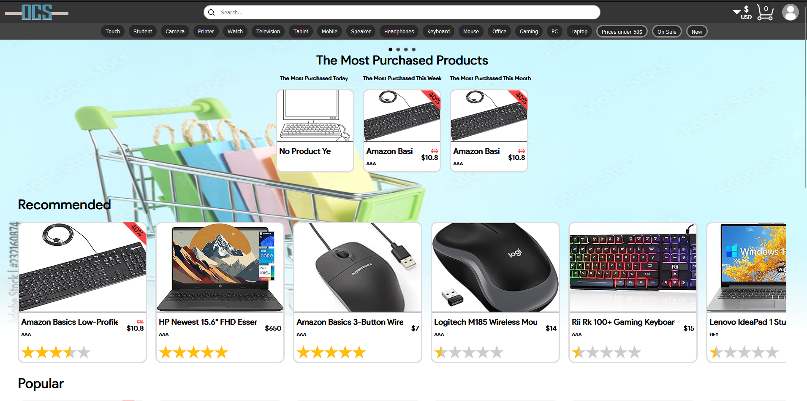

<h1 align="center">
   
  
   
  O.C.S - Online Computer Shop
   
</h1>

<h4 align="center">An online computer shop UI and server built with <a href="https://react.dev/" target="_blank">React</a> and <a href="https://expressjs.com/" target="_blank">Express</a></h4>

  <a href="#key-features">Key Features</a> •
  <a href="#credits">Credits</a>

## Key Features

* Users can login with google
* The app allows suppliers to register and add products
* The apps allows users to view and buy products
* Users can create reviews that affect the total rating of the product
* The homepage recommends each user products using their existing history and product quality
* Search results are ranked by best match, split to keywords and able to find spell errors
* The app allows admins to send and receive emails
* Admins can suspend accounts of suppliers to prevent their products being shown
* Admins and suppliers can view statistics using interactive graphs set by chosen parameters
* Each supplier has their own page with recommended, popular and new products, and generated rating based on all products.
* Users can filter search by price, discount, tags, supplier and sort by price, new, rating, and best match.

## Credits

This software was developed by:

Yaniv Goldshtain,  Alon Eyal,   Eyal Eizner

